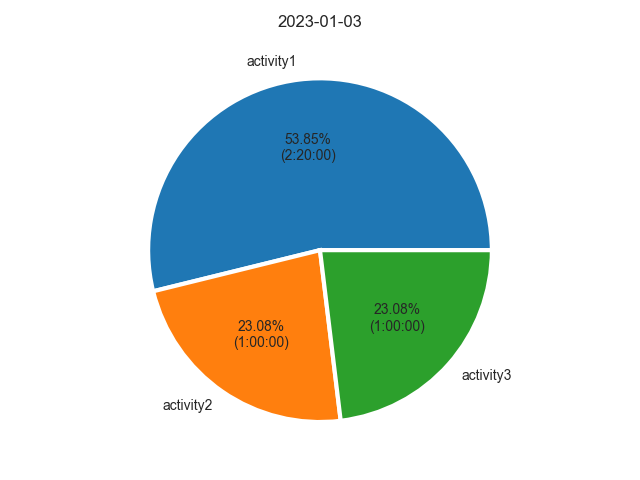

# Productivity Tracker

Short script to execute while you're on your daily work routine to keep track
of your productivity based on the time you spent on different actions.

Sample actions given are: PROJECT, COURSE, HOUSE, REST

## Structure

The module **habit_tracker** implements the 
[MVC (Model-View-Controller) Design Pattern](https://www.geeksforgeeks.org/mvc-design-pattern/) 
to separate the data model, the business logic and the presentation to the user.

Some of the main benefits from this architecture are :
* Improves **maintainability** while reducing **dependencies**.
* Gives the **capability to change the view, or UI**, making it easier to test.

## How to run from startup (Windows 10)

1. Create shortcut to `productivity_tracker.bat`.
2. Run Windows + R and run `shell:startup` to open startup folder.
3. Move the shortcut to that folder.

This way, each time your computer turns on, the script will be run and the productivity tracker
will start to work for your new journey.

## Goals

### Week 1: Basic functionalities, UI, Testing

- [x] **Pie chart for a certain period:** Show percentage of time taken for each user activity.
- [ ] **Linear chart for a full daily basis:** Graphic representing hours of the day at the X axis and the set
of activities at the Y axis. For a single day report, show periods employed on each activity. For multiple day
reports (weekly and monthly reports), show most common activity on each hour of the day.
- [ ] **Organize database by months and weeks:** Logs should be saved on a specific month/week folder, so it's
easier to compute weekly and monthly reports afterwards.
- [ ] **Basic Command Line UI:** Build a first UI version for CLI to be able to test the app. This UI must allow to:
  - Select current activity and control its period.
  - Finish tracking.
  - Graphics visualization options: daily report, last weekly/monthly report or to date.
- [ ] **Testing:** Write Unit tests.

### Week 2: GUI

- [ ] **Select GUI framework:** Investigate options for GUIs with Python. Select the best option.
- [ ] **Past reports visualization:** New option to check past reports so the user can study the increment/decrement
of productivity.

### Week 3: Extras and Add-ons
- [ ] **Automatic tracking:** Investigate if it's possible to track mouse interactions, active windows and user inactivity
with Python (look for packages). If it's possible, try to implement.
- [ ] **Selection of way of tracking:** if automatic tracking is possible, let the user select what type of tracking is desired.
- [ ] **Productivity analysis:** Compare reports and define a logic to measure productivity. Labor and rest periods
should be differentiated to achieve this.
